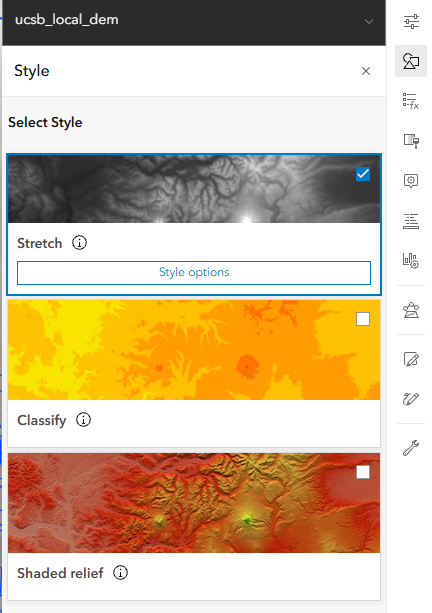
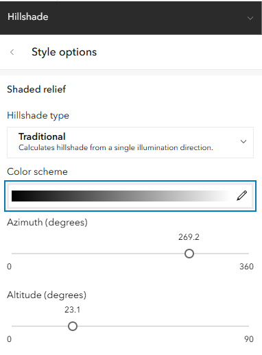
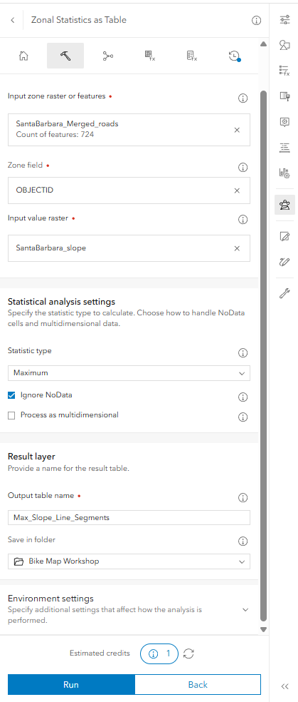
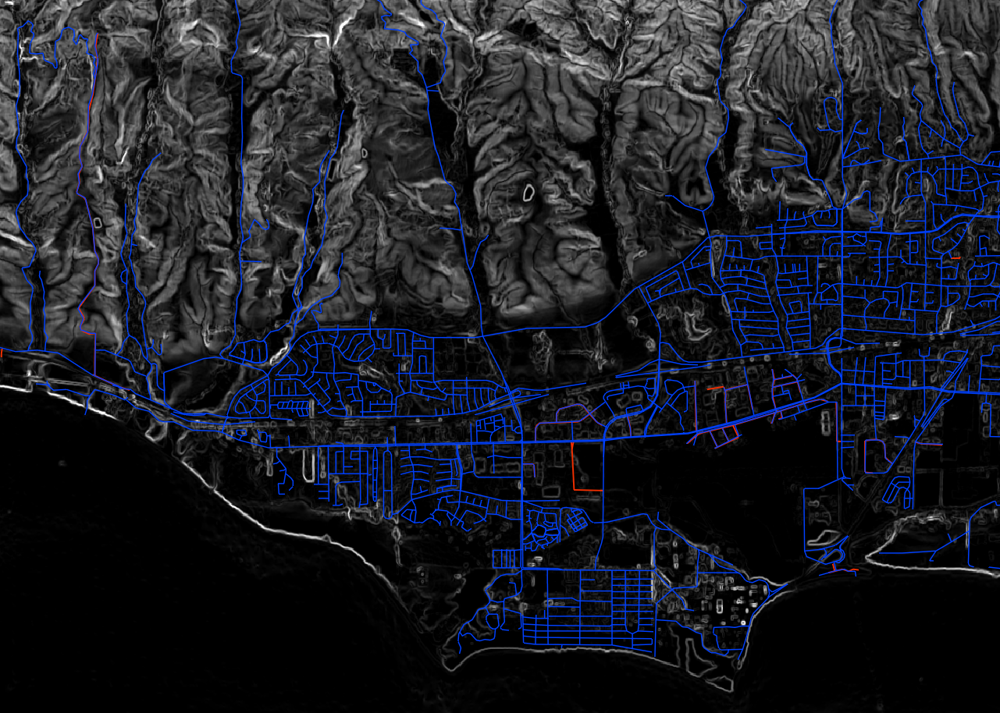

## Exploring Data Types in ArcGIS Online

This lesson focuses on understanding the different types of geographic
data available in ArcGIS Online and learning how to import and work with
your own data.

### Annotations vs. Geospatial Data

In Workshop 1, we introduced sketch layers to draw points, lines, and
polygons directly on top of the map. While sketches are convenient for
quick markups and annotations, they are not true GIS data layers.
Sketches lack an underlying database table and cannot be queried,
filtered, or used in spatial analysis.

In contrast, **geospatial feature layers** link spatial geometries
(points, lines, or polygons) to structured records in an **attribute
table**. Each feature has defined attribute fields (e.g., name, speed
limit, road type, elevation) with specific data types (such as text
strings, integers, floats, and dates). This tabular structure makes it
possible to filter features, symbolize data based on attributes, and
calculate new spatial relationships.

### Review: Workshop 1 Recap

1.  Open and explore the completed map from Workshop 1
    (`Workshop campus bike map`).
2.  Review layer symbology and experiment with the style sliders (such
    as Counts & Amounts).
3.  Perform a **Save As** before moving forward so each participant has
    their own working map copy saved in their personal ArcGIS Online
    workspace.


### Types of Geospatial Data

Geographic data generally falls into two primary models: **vector** and
**raster**.

#### Vector Data

Vector data represents discrete geographic features using coordinate
geometry:

- **Points**: Single $(X, Y)$ coordinate pairs representing discrete
  locations (e.g., bike racks, bus stops, accident locations).
- **Lines (Polylines)**: Ordered sequences of vertices connecting
  locations to represent linear features or networks (e.g., bike paths,
  roads, transit routes, streams).
- **Polygons**: Closed shapes enclosing an area defined by connected
  coordinate vertices (e.g., campus buildings, land parcels, parks,
  water bodies).

Every shape is tied to a row in an attribute table, where each
column holds specific properties describing that feature. For example ...

#### Raster Data

Raster data represents continuous phenomena across the landscape as a
regular grid of square cells (pixels) organized into rows and columns:

- **Single-band rasters**: Each pixel contains a single numerical value
  representing a continuous measurement (such as elevation in a Digital
  Elevation Model \[DEM\], slope, or temperature) or an integer code
  representing a category (such as land cover types).
- **Multi-band rasters**: Each pixel contains multiple values across
  different spectral channels or bands (such as red, green, blue, and
  near-infrared bands in aerial photography or satellite imagery).

### Finding and Adding Data Layers

You can bring data into ArcGIS Online through several avenues:

- **Importing Tabular Data (CSV)**: Import spreadsheet files containing
  latitude and longitude coordinates (e.g., bus stops or bike racks) and convert them directly into point feature
  layers.
- **Uploading Spatial Datasets**: Upload spatial files from your local
  computer (such as Shapefiles, GeoJSON, or rasters) to publish them as
  hosted feature layers.
- **Living Atlas of the World**: Browse and add datasets from Esri's
  repository of global GIS data, including
  environmental, demographic statistics, infrastructure
  networks, and satellite imagery.

::: callout-note
### Esri ArcGIS Online Credits

- All ArcGIS Online accounts created under the UCSB site license are
  allocated **1000 service credits** per license year.
- **Transactions**: Some analysis operations and storage consume service
  credits. For more information, visit Esri's [Understand
  Credits](https://doc.arcgis.com/en/arcgis-online/administer/credits.htm)
  page.
- **Manage your content**: Periodically review and delete unnecessary
  hosted layers and analysis outputs to conserve credits.
- **Data Stewardship**: Objects stored in ArcGIS Online should be
  considered ephemeral. Your content access depends on the UCSB
  Library's Higher Education Site License.
:::

## Narrative

### The Story

Our goal is to plan a scenic, safe, and challenging bicycle route that
leads from the UCSB campus into the surrounding Goleta community and the
Santa Ynez foothills. To accomplish this, we need to expand beyond
campus bike paths and incorporate regional road networks along with
elevation data to analyze terrain and slope.


## Adding New Material to an Old Map

Our finished product for this session will be the
`Workshop Goleta bike map`. We will take time to preview this finished
map before building it step by step.

** link and screenshot of finished map goes here. **

The layers we will work with expand upon Workshop 1 with a wider
geographic extent:

- **Roads and Paths**: An expanded street and bicycle path network
  covering the Goleta and Santa Barbara area, extracted from
  OpenStreetMap.
- **Digital Elevation Model (DEM)**: A raster layer covering campus, the
  coastal plain, and extending into the foothills.
- **Transit**: We may get tired, so we will add bus stops to our map in case we need to put our bike on the bus to get back to campus. We will create this layer from a CSV file. 

### Add Roads

To examine routes beyond campus, we zoom out to the broader regional
area:

1.  Start with your freshly saved copy of the map in your personal
    workspace.
2.  Add the `SantaBarbara_Merged_roads` layer from your organization or
    the workshop group.
3.  Open the attribute table to inspect fields such as highway
    classification, road surface, and speed limits, and symbolize the
    roads to distinguish bike-friendly streets from arterial highways.

### Digital Elevation Models (DEM)

Next, we add a Digital Elevation Model: `ucsb_local_dem`.

#### What is a DEM?

A **Digital Elevation Model (DEM)** is a single-band continuous raster
where each cell represents bare-earth surface elevation relative to a
vertical datum (mean sea level). The `ucsb_local_dem` dataset covers the
UCSB campus, Goleta Slough, and the rising Santa Ynez foothills, derived
from high-resolution USGS 3D Elevation Program (3DEP) LiDAR surveys.

In the layer properties, explore the raster statistics: note the minimum
elevation near sea level (0) along the coast and slough, rising
to hundreds of feet in the foothills, as well as the grid cell
resolution. (make sure we are feet and not meters)

#### Applying Color Schemes

By default, continuous raster layers display using a grayscale "Stretch"
renderer (low values dark, high values light). To clearly distinguish
elevation changes across the coastal plain and mountains, let's change the
symbology to a continuous or diverging color ramp (e.g., a
below-and-above zero diverging ramp or an elevation palette).



#### Creating Shaded Relief (Hillshade) on the Fly

To give the terrain realistic three-dimensional depth and surface
texture, we can generate a shaded relief visualization dynamically:

1.  Duplicate the `ucsb_local_dem` layer.
2.  Rename the two DEM layers for clarity: name the top layer
    `Elevation (Color)` and the bottom layer
    `Elevation (Shaded Relief)`.
3.  Change the symbology style to **Shaded Relief**.

##### Lighting our terrain

Shaded relief simulates how sunlight illuminates terrain, casting
shadows based on the position of the sun measured as two angles: Azimuth and Altitude

- **Azimuth**: The compass direction from which the illumination source
  (the sun) originates, measured in degrees clockwise from north (0° =
  North, 90° = East, 180° = South, 270° = West). In cartography, the sun
  is traditionally positioned in the northwest (315°) or west (270°) to
  match how the human brain interprets light and shadow, preventing an
  optical illusion known as "relief inversion" where mountains appear as
  valleys. For our map, we position the light source from the west.
- **Altitude**: The angle of the sun above the horizon, measured from 0°
  (level with the horizon at sunrise/sunset) to 90° (directly overhead
  at solar noon). A lower altitude (e.g., 30°–45°, typical of low winter
  sun) produces longer, more dramatic shadows that accentuate
  ridgelines, canyons, and valleys.



Adjust the transparency of the top colored elevation layer so the shaded
relief beneath shows through, creating an illuminated 3D terrain effect
under our roads.

{fig-alt="A rainbow colored hillshaded map with roads showing the software interface"}

Save your map at this point.

### Layer Management, Rasters, and Additional Vectors

1.  **Re-order layers**: Ensure vector layers (roads and paths) remain
    on top of the raster elevation layers in the layer stack so they are
    not hidden.
2.  **Categorical Rasters vs. Continuous Rasters**:
    - While elevation is a **continuous raster** (values change smoothly
      along a numerical gradient), other rasters are **categorical
      rasters** (e.g., land cover classification datasets from the
      Living Atlas, where integer cell values represent categories such
      as urban development, forest, or water). ** let's be adding one here **
3.  **Imagery Layers vs. Basemaps**:
    - An **basemap** sits at the bottom of the map canvas,
      serving purely as a static background context. Esri has options that are
      satellite and aerial views. 
    - An **imagery layer** is a data layer added to
      your map stack. It can be re-ordered above or below other layers,
      adjusted with transparency and blend modes, queried for pixel
      values, and analyze for groundcover characteristics.
    - Below we will add a Planet satellite view to campus to explore. 


## Satellite view

##  Vector Layers
    - Import bus stops or trailheads from a CSV spreadsheet using
      coordinate columns (latitude and longitude) to see how external
      tabular data integrates with existing road and elevation layers.
    - Refresh memory on building layer
    - Add a living atlas layer?


## Looking Ahead: Spatial Analysis (Preview for Workshop 3)

In Workshop 3, we dive deeper into quantitative spatial analysis. The
data layers we prepared today form the foundation for analyzing terrain
and route difficulty:

```         
- Calculate slope from the DEM (a single-channel continuous raster measuring steepness)
- Overlay slope values onto road segments
- Identify and highlight the steepest climbs (maximum slope)
```

### Analysis Workflow Overview

1.  **Slope Calculation**: Use raster analysis tools to calculate a
    slope raster from the DEM, expressing terrain steepness in degrees
    or percent rise.
2.  **Zonal Statistics as Table**: With the slope raster and the road
    network loaded, run **Raster Analysis \> Zonal Statistics as Table**
    to compute summary statistics (such as the maximum or mean slope)
    for each road line.



3.  **Joining Statistics to Roads**: The zonal statistics tool outputs a
    standalone data table. To visualize these slope measurements on the
    map, join the table back to the road vector layer using **Tools \>
    Summarize data \> Join Features**, matching on a common identifier
    such as `OBJECTID`.



4.  Once joined, roads can be symbolized by slope steepness, allowing us
    to pinpoint the steepest hill climbs for our ride!
